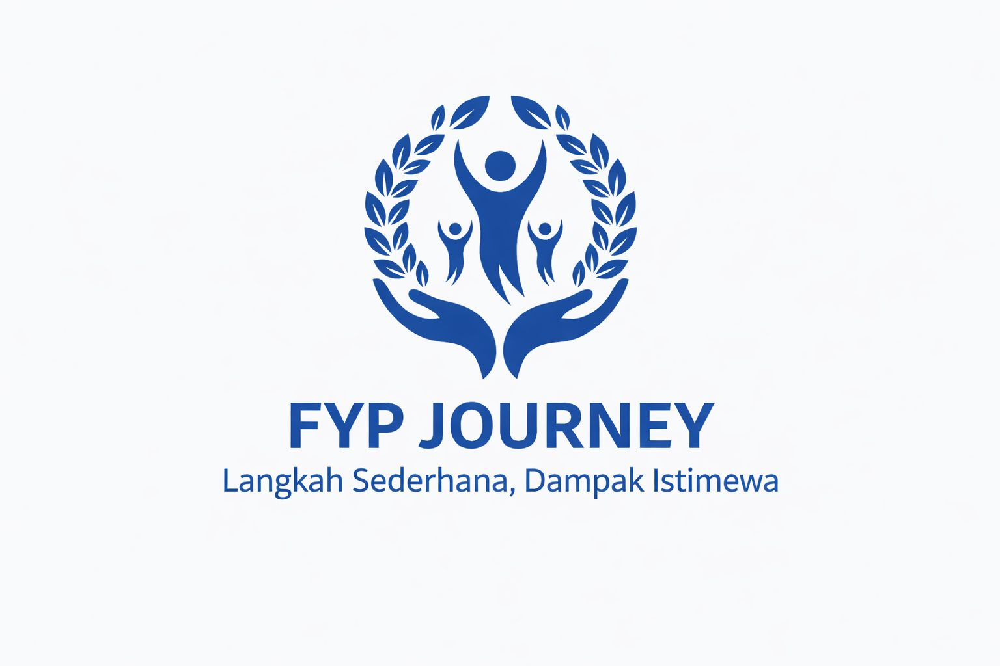

<p align="center">
  
</p>

<h1 align="center">FYP Journey Official Website</h1>

<p align="center">
  Website resmi FYP Journey, komunitas sosial pendidikan untuk ruang bertumbuh, belajar, dan berbagi.
</p>

<p align="center">
  <a href="https://www.fypjourney.com">
    
  </a>
  
  
  
</p>

## About

**FYP Journey** adalah website profil resmi untuk memperkenalkan komunitas, nilai, program, dan kanal komunikasi FYP Journey kepada publik. Website ini dirancang sebagai pengalaman digital yang ringan, informatif, mobile-friendly, dan mudah dirawat.

Tagline utama:

> Langkah Sederhana, Dampak Istimewa

## Brand Identity

| Item | Detail |
| --- | --- |
| Brand | FYP Journey |
| Founder | Fitri Yusmia Putri |
| Category | Komunitas Sosial Pendidikan |
| Audience | Pelajar, mahasiswa, fresh graduate, dan masyarakat umum |
| Tone | Hangat, suportif, edukatif, dan terpercaya |
| Website | [www.fypjourney.com](https://www.fypjourney.com) |

## Key Features

- **Hero landing page** dengan CTA menuju program dan WhatsApp.
- **About carousel** untuk cerita brand, founder, dan identitas visual.
- **Program showcase** untuk Sharing Session, Mentoring Beasiswa, Mentoring Paper & Jurnal, dan Social Project.
- **Program detail pages** untuk informasi layanan yang lebih lengkap.
- **FAQ section** untuk menjawab pertanyaan umum.
- **Question form** yang diarahkan ke WhatsApp resmi tanpa backend berbayar.
- **Footer navigation** dengan kontak dan social links aktif.
- **SEO metadata** untuk title, description, canonical, Open Graph, Twitter Card, dan JSON-LD.
- **Security baseline** melalui `robots.txt`, `.htaccess`, dan `_headers`.

## Programs

| Program | Purpose |
| --- | --- |
| Sharing Session | Ruang cerita yang aman, suportif, dan empatik. |
| Mentoring Beasiswa | Pendampingan persiapan beasiswa, esai, dan interview. |
| Mentoring Paper & Jurnal | Pendampingan penulisan karya ilmiah, paper, artikel, dan jurnal. |
| Social Project | Inisiatif donasi alat tulis untuk mendukung pendidikan. |

## Tech Stack

| Layer | Technology |
| --- | --- |
| Markup | HTML5 |
| Styling | CSS3 modular |
| Interaction | Vanilla JavaScript ES Modules |
| Components | Partial HTML loader |
| Icons | Inline SVG and Font Awesome |
| Assets | Local images, favicons, and web manifest |
| Hosting Target | Static hosting / Apache-compatible hosting |

## Project Structure

```text
.
|-- index.html
|-- robots.txt
|-- sitemap.xml
|-- _headers
|-- .htaccess
|-- assets/
|   |-- css/
|   |-- favicons/
|   |-- images/
|   `-- js/
|-- partials/
|   |-- header.html
|   `-- footer.html
`-- programs/
    |-- sharing-session.html
    |-- mentoring-beasiswa.html
    |-- mentoring-paper.html
    `-- social-project.html
```

## Architecture Notes

Website ini memakai arsitektur static modular:

- `index.html` sebagai halaman utama.
- `partials/header.html` dan `partials/footer.html` dimuat melalui component loader.
- CSS dipisah berdasarkan global style dan komponen.
- JavaScript dipisah berdasarkan interaksi halaman seperti slider, parallax, dan contact form.
- Halaman program berada di folder `programs/` agar URL lebih rapi dan mudah dikelola.

## Security Baseline

Project ini menyertakan konfigurasi hardening dasar untuk website statis:

- `robots.txt` untuk membatasi crawler yang patuh.
- `.htaccess` untuk Apache/cPanel hardening.
- `_headers` untuk static hosting yang mendukung custom response headers.
- HTTPS enforcement.
- Disabled directory listing.
- Basic protection untuk file sensitif dan backup files.
- Security headers:
  - `X-Content-Type-Options`
  - `X-Frame-Options`
  - `Referrer-Policy`
  - `Permissions-Policy`
  - `Cross-Origin-Opener-Policy`
  - `Cross-Origin-Resource-Policy`
  - `X-Permitted-Cross-Domain-Policies`
  - `Strict-Transport-Security`

Catatan: `robots.txt` bukan mekanisme keamanan utama. File dan data sensitif tetap tidak boleh berada di public web root.

## SEO & Discoverability

Project ini telah menyiapkan:

- Primary SEO metadata.
- Canonical URL.
- Open Graph social preview.
- Twitter Card metadata.
- Organization structured data.
- Sitemap XML.
- Web manifest dan favicon set.

## Contact Flow

Form pertanyaan tidak menggunakan Formspree atau layanan backend pihak ketiga. Saat user mengisi form, website akan membuat pesan WhatsApp otomatis berisi:

- Nama
- Email
- Pertanyaan

Pendekatan ini menjaga ownership tetap di pihak client, menghindari subscription form backend, dan membuat maintenance lebih sederhana.

## Maintainer Notes

Saat melakukan update konten, area yang paling sering disentuh:

- `index.html` untuk konten landing page.
- `partials/header.html` untuk navigasi.
- `partials/footer.html` untuk kontak dan social links.
- `programs/*.html` untuk halaman detail program.
- `assets/images/` untuk gambar program, founder, dan brand.
- `sitemap.xml` jika ada halaman baru.

## Contact

| Channel | Link |
| --- | --- |
| Website | [www.fypjourney.com](https://www.fypjourney.com) |
| WhatsApp | [+62 877-7941-5292](https://wa.me/6287779415292) |
| Email | [fypjourneyofficial@gmail.com](mailto:fypjourneyofficial@gmail.com) |
| Instagram | [@fypjourney](https://www.instagram.com/fypjourney) |
| Spotify | [FYP Journey Podcast](https://open.spotify.com/show/1ynhXjMSVGgqYJvuqyYpv6?si=Kdny3gkdQgKSmmWUSUOFHw) |

---

<p align="center">
  <strong>FYP Journey</strong><br>
  Langkah Sederhana, Dampak Istimewa.
</p>
